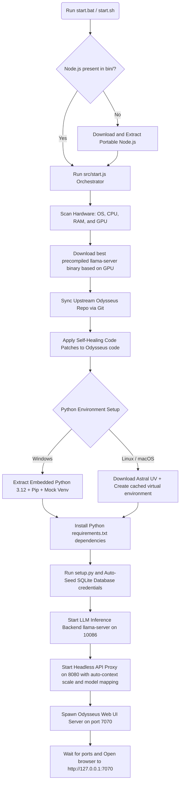

# 🌌 Odysseus Portable AI Workspace

A unified, 100% self-contained, open-source, and offline-first local AI agent workspace. This project bundles **Odysseus** (a premium, local Claude/ChatGPT-like web interface featuring SQLite memory, calendars, custom agents, and deep research) alongside a dynamic, hardware-optimized local **llama.cpp** inference engine.

Everything runs portably from any directory or USB drive without requiring pre-installed system dependencies.

---

<p align="center">
  
  
  
  
  
</p>

---


## ✨ Introduction

Odysseus Portable provides an offline-first AI agent interface that does not require global system installations or administrator privileges. 

> [!IMPORTANT]
> **Data Portability Guarantee**: All user data, databases, config parameters, cached models, and secrets remain inside the project folder directory. Unplugging the USB drive leaves no configuration traces, files, or environment variables on the host system.

---

## ⚙️ How It Works (Setup Flow)

When you run the script, the orchestrator handles hardware scanning, runtime extraction, dependency checks, database seeding, and application setup:



---

## 💻 Supported Platforms

The launcher supports **Windows**, **macOS** (Intel & Apple Silicon), and **Linux** (x64 & ARM64). 

> [!NOTE]
> Each operating system platform creates its own isolated directory structure under the `/bin` and cache folders (e.g. `bin/node-linux-x64` or `bin/node/` on Windows) to prevent configuration collisons when running the same USB drive on different machines.

---

## 💾 Storage Footprint Guidance

Because GGUF model files can be large, ensure your external drive matches the capacity required:

| Parameter | Minimum | Recommended |
|-----------|---------|-------------|
| **USB/Drive Size** | **8 GB** | **64 GB or 128 GB** (High-speed SSD/USB 3.0+) |
| **Launcher Code & Runtimes** | ~1.5 GB | ~2.5 GB (after package compilations) |
| **Model Capacities** | 0.5B - 3B GGUF (~1GB - 2.5GB) | 7B - 8B GGUF (~4.5GB - 5GB) |

---

## 🚀 Quick Start

### Windows
1. Double-click `start.bat` or run the following command in Command Prompt:
   ```cmd
   start.bat
   ```
2. The orchestrator downloads dependencies and displays the local model selection prompt.
3. Select your model and sign in to the web app interface at `http://127.0.0.1:7070`.

### macOS
1. Open a terminal in the project directory, grant execution rights, and run:
   ```bash
   chmod +x start.sh
   ./start.sh
   ```

### Linux
1. Open a terminal and execute:
   ```bash
   chmod +x start.sh
   ./start.sh
   ```

---

## 📂 Directory Structure

```text
Odysseus-Portable/
├── start.bat                 # Windows startup script
├── start.sh                  # macOS and Linux startup script
├── LICENSE                   # Open-source MIT License
├── package.json              # Launcher Node.js configuration
├── README.md                 # Documentation
├── src/                      # Orchestrator Source Code
│   ├── start.js              # Launcher process runner
│   ├── system.js             # Hardware and OS scanner
│   ├── downloader.js         # Package downloader
│   ├── model.js              # GGUF downloader and scanner
│   ├── runtime.js            # Subprocess manager
│   └── backends/             # Inference runners
│       ├── common.js         # SQLite seeder
│       └── llama/            # llama-server proxy
├── bin/                      # Downloaded runtimes (Node, python, llama-server)
├── models/                   # Local GGUF models folder
├── odysseus/                 # Cloned Odysseus repository
├── logs/                     # Session stderr and stdout logs
└── scripts/                  # Cleanup and bootstrappers
```

---

## 🛠️ Configuration & Environment

Settings can be customized by editing the config at `data/launcher_config.json` or by overriding variables during execution:

| Variable | Description | Default |
|----------|-------------|---------|
| `ODYSSEUS_LLAMA_CTX` | Forces a specific llama.cpp context window size | Auto-calculated |
| `ODYSSEUS_LLAMA_PARALLEL` | Number of parallel slots to initialize in llama-server | `1` |
| `ODYSSEUS_ADMIN_USER` | Custom admin username seeded during setup | `admin` |
| `ODYSSEUS_ADMIN_PASSWORD` | Custom admin password seeded during setup | `techjarves` |

### Hugging Face Credentials Setup
If you need to query or download private/gated models from Hugging Face, create a `.env` file inside the root of the `./odysseus` directory:

```env
# Save as: odysseus/.env
# Replace the placeholder value below with your actual read token from HuggingFace
HUGGING_FACE_HUB_TOKEN=hf_yourPlaceholderReadTokenHere
```

---

## 🔄 Update Instructions

- **Launcher updates**: Run `git pull` inside the `Odysseus-Portable` folder.
- **Odysseus Web App updates**: The orchestrator checks the `./odysseus` git repository status on every launch and automatically pulls updates (`git pull --ff-only`) if it is connected to the internet.

---

## 🛡️ Security Advisory

- **Port Isolation**: By default, `llama-server` and the `Odysseus` web app bind to `127.0.0.1` (localhost). Do not bind these servers to `0.0.0.0` on untrusted networks, as it exposes your local inference API and SQLite database to anyone on your network.
- **Admin Password**: Change the default admin password (`techjarves`) in the user profile settings after signing in.

---

## 💡 Troubleshooting & FAQ

<details>
<summary><b>1. Port is already in use error</b></summary>

Check if you are running other web servers or instances on ports `7070` (Odysseus Web), `8080` (API Proxy), or `10086` (llama-server). Terminate them and run the startup script again.
</details>

<details>
<summary><b>2. GGUF model fails to load or Out of Memory (OOM)</b></summary>

If a selected GGUF model is too large for your system's VRAM/RAM, the proxy server will automatically step down the context size limit and reboot the backend. If it still crashes, download a smaller model quantization (e.g. Q4_K_M or Q2_K) or a model with fewer parameters (e.g. 1.5B or 3B).
</details>

<details>
<summary><b>3. exFAT/FAT32 USB drive symbolic link errors</b></summary>

exFAT and FAT32 file systems do not support symbolic links. The launcher automatically detects this and falls back to **hardlinks** or copy operations to organize nested folders.
</details>

---

## 📄 Open Source & License

This project is 100% open-source and released under the **MIT License**. 

### Credits & Attribution
- **Odysseus UI**: Created and maintained by **[pewdiepie-archdaemon](https://github.com/pewdiepie-archdaemon)** (also known as **PewDewPie**).
- **llama.cpp**: Created and maintained by **[ggml-org](https://github.com/ggml-org)**.
- **UV**: Developed by **[Astral](https://github.com/astral-sh)**.
- **Orchestration Wrapper**: Maintained by the open-source community.
